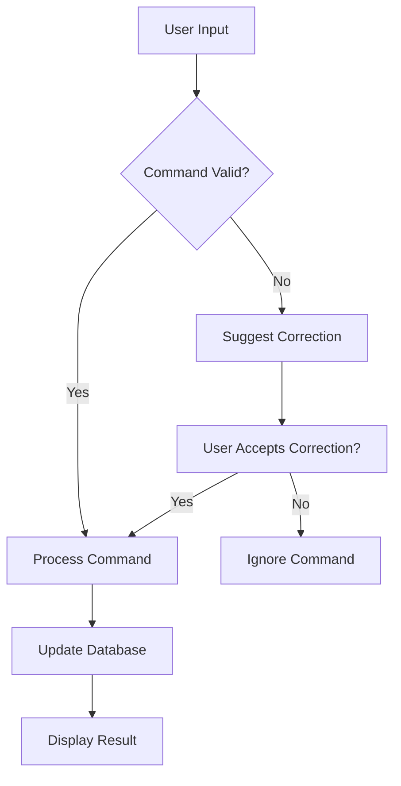
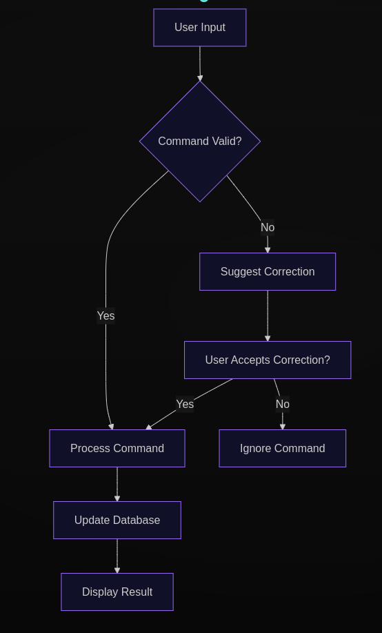

# Developer Documentation for Linux Book CLI Utility

## Introduction
The Linux Book CLI Utility is designed to assist users in recalling and executing various Linux commands. It provides an interactive interface where users can input commands and receive immediate feedback.

## Command Structure and Usage
The command processor interprets user input and executes the corresponding actions. Below are some of the available commands:

- **/new --key --val**: Insert your own Linux snippet.
- **/get --work**: Get the command that performs a specific work.
- **/get --cmd**: Get the work that a specific command does.
- **/update --where --new-val**: Update the command for a specific work.
- **/delete <work>**: Delete a key-value pair.
- **/all**: Display all key-value pairs.
- **/exit**: Exit the program.
- **/clear**: Clear the screen.
- **/learn**: Toggle learning from user mistakes.
- **/h**: Show this help message.

## Error Correction Suggestions
The application includes an error correction mechanism that listens for user mistakes. When a user inputs an incorrect command, the application suggests corrections based on previously learned errors. The flow is as follows:

1. User inputs a command.
2. If the command is incorrect, the application checks its error database.
3. It retrieves the suggested correction and prompts the user.
4. The user can choose to accept the correction, which updates the command for execution.

## Database Interactions
The application uses SQLite for data management. The `DatabaseController` class provides methods for interacting with the database, including:

- **insert_new_pair(key: str, value: str)**: Inserts a new key-value pair into the database.
- **get_value(key: str)**: Retrieves the value associated with a specific key.
- **delete_pair(key: str)**: Deletes a key-value pair from the database.
- **update_value(key: str, value: str)**: Updates the value for a specific key.
- **get_all_keys()**: Retrieves all keys from the database.
- **get_key_by_value(value: str)**: Retrieves the key associated with a specific value.

## Command Descriptions
Refer to the `resources/commands_data.json` file for detailed descriptions of each command and its arguments.

## Command Processing Flow

